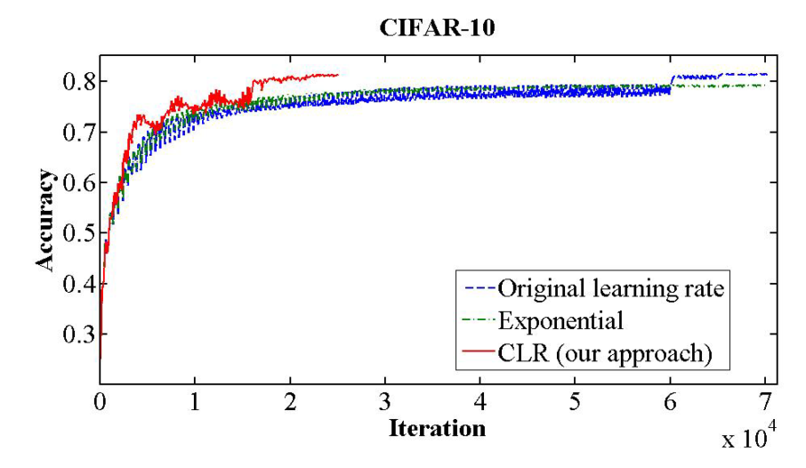
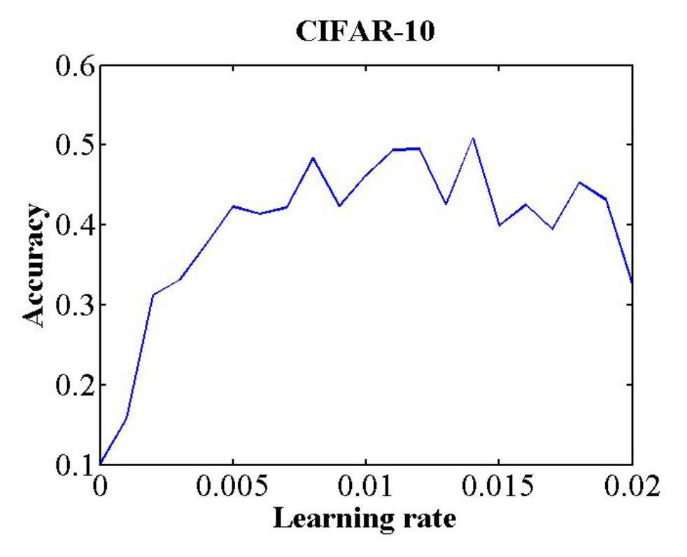

# Cyclical Learning Rate (CLR)


This repository includes a Keras callback to be used in training that allows implementation of cyclical learning rate policies, as detailed in Leslie Smith's paper [Cyclical Learning Rates for Training Neural Networks
arXiv:1506.01186v4](https://arxiv.org/abs/1506.01186 "Title").

A cyclical learning rate is a policy of learning rate adjustment that increases the learning rate off a base value in a cyclical nature. Typically the frequency of the cycle is constant, but the amplitude is often scaled dynamically at either each cycle or each mini-batch iteration.

## Why CLR


The author demonstrates how CLR policies can provide quicker converge for some neural network tasks and architectures.
One example from the paper compares validation accuracy for classification on the CIFAR-10 dataset. In this specific example, the author used a `triangular2` clr policy (detailed below). With clr, their model reached 81.4% validation accuracy in only 25,000 iterations compared to 70,000 iterations with standard hyperparameter settings.

One reason this approach may work well is because increasing the learning rate is an effective way of escaping saddle points. By cycling the learning rate, we're guaranteeing that such an increase will take place if we end up in a saddle point. 

## CyclicLR()

The purpose of this class is to not only provide an easy implementation of CLR for Keras, but to enable easy experimentation with policies not explored in the original paper.

`clr_callback.py` contains the callback class `CyclicLR()`.

This class includes 3 built-in CLR policies, `'triangular'`, `'triangular2'`, and `'exp_range'`, as detailed in the original paper. It also allows for custom amplitude scaling functions, enabling easy experimentation.

Arguments for this class include:
* `base_lr`: initial learning rate, which is the lower boundary in the cycle. This overrides optimizer `lr`. Default 0.001.
* `max_lr`: upper boundary in the cycle. Functionally, it defines the cycle amplitude (`max_lr` - `base_lr`). The lr at any cycle is the sum of `base_lr` and some scaling of the amplitude; therefore `max_lr` may not actually be reached depending on scaling function. Default 0.006.
* `step_size`: number of training iterations per half cycle. Authors suggest setting `step_size = (2-8) x (training iterations in epoch)`. Default 2000.
* `mode`: one of `{'triangular', 'triangular2', 'exp_range'}`. Values correspond to policies detailed below. If `scale_fn` is not `None`, this argument is ignored. Default `'triangular'`.
* `gamma`: constant in `'exp_range'` scaling function, `gamma^(cycle iterations)`. Default 1.
* `scale_fn`: Custom scaling policy defined by a single argument lambda function, where `0 <= scale_fn(x) <= 1` for all `x >= 0`. `mode` parameter is ignored when this argument is used. Default `None`.
* `scale_mode`: `{'cycle', 'iterations'}`. Defines whether `scale_fn` is evaluated on cycle number or cycle iterations (training iterations since start of cycle). Default is `'cycle'`.

**NOTE: `base_lr` overrides `optimizer.lr`**

The general structure of the policy algorithm is:

```python
cycle = np.floor(1+iterations/(2*step_size))
x = np.abs(iterations/step_size - 2*cycle + 1)
lr= base_lr + (max_lr-base_lr)*np.maximum(0, (1-x))*scale_fn(x)
```
where `x` is either `iterations` or `cycle`, depending on `scale_mode`.

`CyclicLR()` can be used with any optimizer in Keras.

### Syncing cycle and training iterations

The author points out that the best accuracies are typically attained by ending with the base learning rate. Therefore it's recommended to make sure your training finishes at the end of the cycle.

# Policies

## triangular


This method is a simple triangular cycle.

Basic algorithm:

```python
cycle = np.floor(1+iterations/(2*step_size))
x = np.abs(iterations/step_size - 2*cycle + 1)
lr = base_lr + (max_lr-base_lr)*np.maximum(0, (1-x))
```

Default triangular clr policy example:
```python
    clr = CyclicLR(base_lr=0.001, max_lr=0.006,
                        step_size=2000.)
    model.fit(X_train, Y_train, callbacks=[clr])
``` 

Results:


## triangular2


This method is a triangular cycle that decreases the cycle amplitude by half after each period, while keeping the base lr constant. This is an example of scaling on cycle number.

Basic algorithm:

```python
cycle = np.floor(1+iterations/(2*step_size))
x = np.abs(iterations/step_size - 2*cycle + 1)
lr = base_lr + (max_lr-base_lr)*np.maximum(0, (1-x))/float(2**(cycle-1))
```

Default triangular clr policy example:

```python
    clr = CyclicLR(base_lr=0.001, max_lr=0.006,
                        step_size=2000., mode='triangular2')
    model.fit(X_train, Y_train, callbacks=[clr])
``` 

Results:


## exp_range


This method is a triangular cycle that scales the cycle amplitude by a factor `gamma**(iterations)`, while keeping the base lr constant. This is an example of scaling on iteration.

Basic algorithm:

```python
cycle = np.floor(1+iterations/(2*step_size))
x = np.abs(iterations/step_size - 2*cycle + 1)
lr= base_lr + (max_lr-base_lr)*np.maximum(0, (1-x))*gamma**(iterations)
```

Default triangular clr policy example:

```python
    clr = CyclicLR(base_lr=0.001, max_lr=0.006,
                        step_size=2000., mode='exp_range',
                        gamma=0.99994)
    model.fit(X_train, Y_train, callbacks=[clr])
``` 

Results:


## Custom Cycle-Policy

This method is a triangular cycle that scales the cycle amplitude sinusoidally. This is an example of scaling on cycle.

Basic algorithm:

```python
cycle = np.floor(1+iterations/(2*step_size))
x = np.abs(iterations/step_size - 2*cycle + 1)
lr= base_lr + (max_lr-base_lr)*np.maximum(0, (1-x))*0.5*(1+np.sin(cycle*np.pi/2.))
```

Default custom cycle-policy example:
```python
    clr_fn = lambda x: 0.5*(1+np.sin(x*np.pi/2.))
    clr = CyclicLR(base_lr=0.001, max_lr=0.006,
                        step_size=2000., scale_fn=clr_fn,
                        scale_mode='cycle')
    model.fit(X_train, Y_train, callbacks=[clr])
``` 

Results:


## Custom Iteration-Policy

This method is a triangular cycle that scales the cycle amplitude as a function of the cycle iterations. This is an example of scaling on iteration.

Basic algorithm:

```python
cycle = np.floor(1+iterations/(2*step_size))
x = np.abs(iterations/step_size - 2*cycle + 1)
lr= base_lr + (max_lr-base_lr)*np.maximum(0, (1-x))*1/(5**(iterations*0.0001))
```

Default custom cycle-policy example:
```python
    clr_fn = lambda x: 1/(5**(x*0.0001))
    clr = CyclicLR(base_lr=0.001, max_lr=0.006,
                        step_size=2000., scale_fn=clr_fn,
                        scale_mode='iterations')
    model.fit(X_train, Y_train, callbacks=[clr])
``` 

Results:


This result highlights one of the key differences between scaling on cycle vs scaling on iteration. When you scale on cycle, the absolute change in learning rate from one iteration to the next is always constant in a cycle. Scaling on iteration alters the absolute change at every iteration; in this particular case, the absolute change is monotonically decreasing. This results in the curvature between peaks.

# Additional Information

## Changing/resetting Cycle

During training, you may wish to adjust your cycle parameters: 

```python
clr._reset(new_base_lr,
           new_max_lr,
           new_step_size)
```
Calling `_reset()` allows you to start a new cycle w/ new parameters. 

`_reset()` also sets the cycle iteration count to zero. If you are using a policy with dynamic amplitude scaling, this ensures the scaling function is reset.

If an argument is not not included in the function call, then the corresponding parameter is unchanged in the new cycle. As a consequence, calling 

```python
clr._reset()
```

simply resets the original cycle.

## History

`CyclicLR()` keeps track of learning rates, loss, metrics and more in the `history` attribute dict. This generated many of the plots above.

Note: iterations in the history is the running training iterations; it is distinct from the cycle iterations and does not reset. This allows you to plot your learning rates over training iterations, even after you change/reset the cycle.

Example:


## Choosing a suitable base_lr/max_lr (LR Range Test)


The author offers a simple approach to determining the boundaries of your cycle by increasing the learning rate over a number of epochs and observing the results. They refer to this as an "LR range test."

An LR range test can be done using the `triangular` policy; simply set `base_lr` and `max_lr` to define the entire range you wish to test over, and set `step_size` to be the total number of iterations in the number of epochs you wish to test on. This linearly increases the learning rate at each iteration over the range desired.

The author suggests choosing `base_lr` and `max_lr` by plotting accuracy vs. learning rate. Choose `base_lr` to be the learning rate where accuracy starts to increase, and choose `max_lr` to be the learning rate where accuracy starts to slow, oscillate, or fall (the elbow). In the example above, Smith chose 0.001 and 0.006 as `base_lr` and `max_lr` respectively.

### Plotting Accuracy vs. Learning Rate
In order to plot accuracy vs learning rate, you can use the `.history` attribute to get the learning rates and accuracy at each iteration.

```python
model.fit(X, Y, callbacks=[clr])
h = clr.history
lr = h['lr']
acc = h['acc']
```

## Order of learning rate augmentation
Note that the clr callback updates the learning rate prior to any further learning rate adjustments as called for in a given optimizer.

## Functionality Test

clr_callback_tests.ipynb contains tests demonstrating desired behavior of optimizers.
